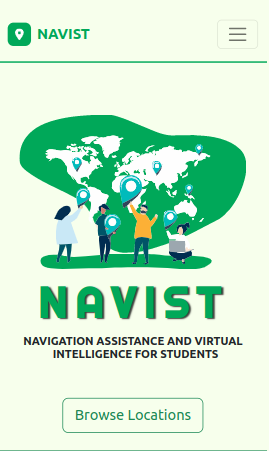

# NAVIST
<h1 align="center"> Navist 2023 Google Developer Student Club (Gombe State University, Nigeria), Solution Challenge</h1>

  

## Introduction 🙋‍♂️
> Navigation assistant and virtual intelligence for students **(Navist)** is a **web app** that utilizes the use of google technologies to help students (especially freshers) navigate campus and provide them with free and easy access to learning materials such as: 
- handouts, 
- past exams questions 
- And past test question

* **Goal 4: Quality Education** 

> The specific targets that we are aiming to achieve through our solution are:

> We chose these specific SDGs and targets because our problem Suvey

## The app has the following Features:

* **Note** 

## Application Screenshots

<!-- | Login with Google  | Home Page | Market Place |
| ------------- | ------------- | ------------- |
|   |   |   |

| Sell a Product  | Training | Forum |
| ------------- | ------------- | ------------- |
|   |   |   |

| Loans  | Keep Notes | Weather |
| ------------- | ------------- | ------------- |
|   |   |   | -->

## Shoutout
* 
